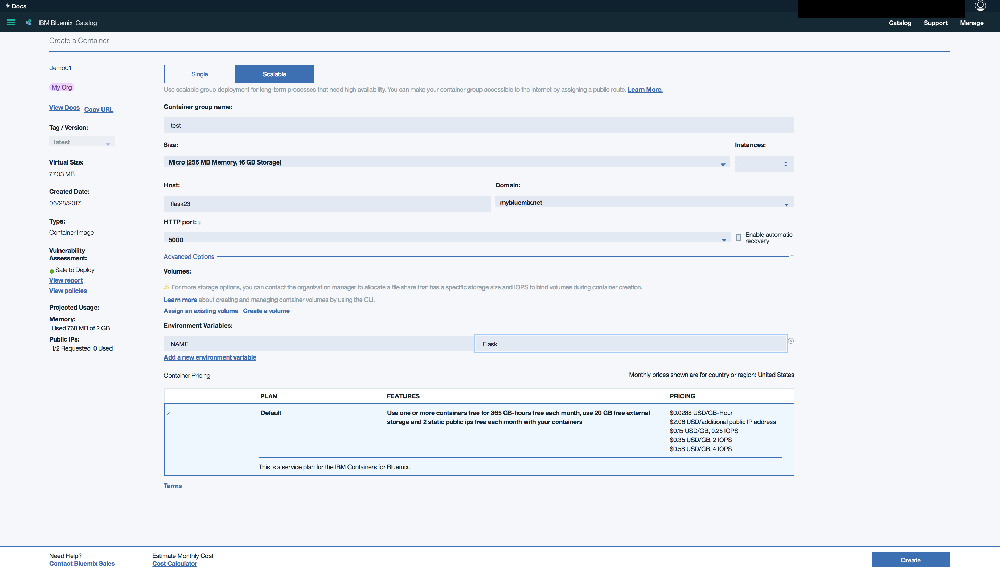

## Bluemix Adventures - Part 1
Rajan Khullar

### [What is Docker][docker-what]
Docker makes it easier to deploy applications by allowing environents to be consistent from development to production. A dockerfile containes instructions to build a dockerfile. The instrucions include what base image to use, which packages to install, application code, ports, commands, etc. Like virtual machines docker containers provide isolated environments for software to run. Unlike VMs the containers do not include a full operating system. "This makes for efficient, lightweight, self-contained systems and guarantees that software will always run the same, regardless of where it’s deployed."

|             Containers             |         Virtual Machines          |
| :--------------------------------: | :-------------------------------: |
|  |  |

### Objective
Create and deploy a hello world Flask application on Bluemix through IBM Containers.

### Prerequisistes
[Docker][docker] - [Bluemix CLI][bx-cli] - [Container Plugin][bx-ic]

<div style="page-break-after: always;"></div>

### Write the application

``` sh
mkdir path/to/project
cd path/to/project
touch Dockerfile requirements.txt server.py
```
```sh
# Dockerfile
FROM python:3.6.1-slim
WORKDIR /app
ADD . /app
RUN pip install -r requirements.txt
EXPOSE 5000
ENV NAME World
CMD ["python", "server.py"]
```
```sh
# requirements.txt
Flask
```
``` python
# server.py
from flask import Flask, jsonify
import os

app = Flask(__name__)

name = os.getenv('NAME')

@app.route('/')
def index():
    return jsonify(message=f'Hello {name}')

if __name__ == '__main__':
    app.run(host='0.0.0.0', port=5000)
```

<div style="page-break-after: always;"></div>

### Test your application
``` sh
python server.py
```

### Test with Docker
``` sh
# build an image from the docker file
docker build -t TAG .
# list images
docker images
# create a container with mapped ports
docker create -p HPORT:CPORT --name CONTAINER TAG
# start the container
docker start CONTAINER
# list running containers
docker ps
# test the container works
curl localhost:HPORT
# stop the container
docker stop CONTAINER
```

### Deploy to Bluemix

The docker image must be uploaded to bluemix by either building the dockerfile with the container plugin, or by copying the image from another registry. 

``` sh
# login to bluemix console
bx login
# initialize registry
bx ic init
# build and push image 
bx ic build -t TAG .
```

<div style="page-break-after: always;"></div>

Now that the image exists on bluemix's registry, deployment can continue with either the console or the web portal. The following walks through how to create a single container for your application and give it a public IP address.

``` sh
# list available images
bx ic images
# show repository name
bx ic namespace-get
# create container
bx ic create -p HPORT:CPORT --name CONTAINER NAMESPACE/TAG
# request an ip address
bx ic ip-request
# list ip addresses
bx ic ips
# bind ip to container
bx ic ip-bind IP CONTAINER
# start the container
bx ic start CONTAINER
# test the container
curl IP:HPORT
```

We can easily add a route and some security by creating a container group. First create a route  through the bluemix plugin. Then use the web portal to create the group and deploy the application.

``` sh
# the default domain is mybluemix.net
bx app route-create SPACE DOMAIN -n HOST
bx cf routes
```



[docker]: www.docker.com/
[docker-what]: www.docker.com/what-docker
[bx-cli]: clis.ng.bluemix.net/ui/home.html
[bx-ic]: console.bluemix.net/docs/containers/container_cli_cfic_install.html#install_plugin
[diff]: www.docker.com/what-container